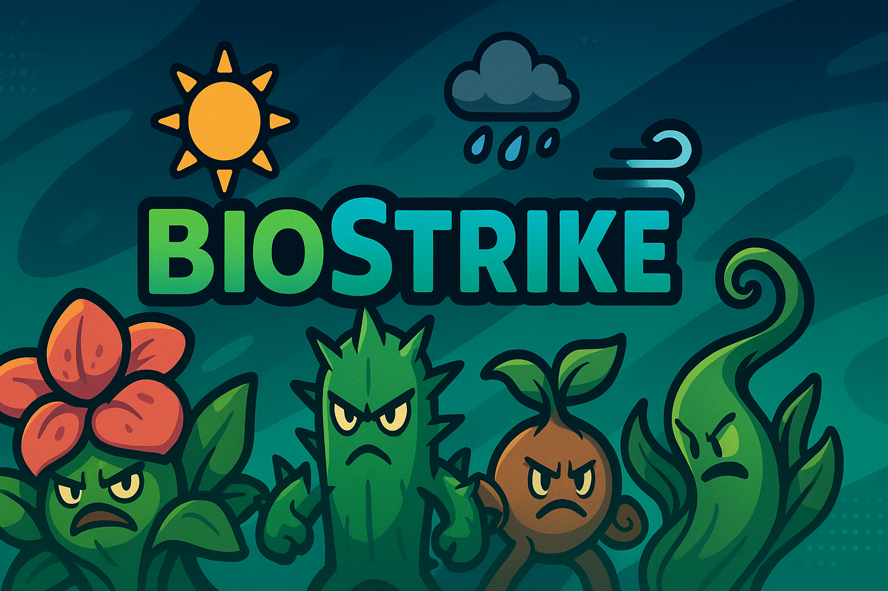

# BioStrike



> **BioStrike** ist ein server‑autoritäres, rundenbasiertes Taktikspiel im Cartoon‑Look. Du führst ein Team aus pflanzenartigen Kreaturen durch dynamische Arenen, in denen Wetter und Ökologie den Ausschlag geben. Statt reiner Zahlen‑Schlachten steht dein Verständnis für Wasserhaushalt, Photosynthese, Transpiration und Zustände wie **Übernässe (Wurzelrot)** oder **Verdursten** im Mittelpunkt.

## 🧭 Inhaltsverzeichnis

- [Vision & Kernmechaniken](#vision--kernmechaniken)
- [Projektstruktur](#projektstruktur)
- [Schnellstart](#schnellstart)
- [Mitwirken](#mitwirken)
- [Lizenz](#lizenz)
- [Weitere Ressourcen](#weitere-ressourcen)

## 🌱 Vision & Kernmechaniken

- **Ökologie als Kernmechanik:** Wetterparameter wie Hitze, Kälte, Trockenheit, Nässe, Wind und Bewölkung beeinflussen jede Runde die Transpiration, Regenaufnahme und Photosynthese deiner Florans. Zu wenig Wasser führt zum *Verdursten*, zu viel zum *Wurzelrot*.
- **Transparente Werte:** Klare Attribute wie HP, Kapazität, aktuelles Wasser, Oberfläche, Initiative, Offense/Defense und Resistenzen. Alle Effekte werden im Log nachvollziehbar aufgeschlüsselt.
- **Dualer Knock‑out:** Neben klassischem HP‑KO können Florans auch durch Austrocknung oder Wurzelrot besiegt werden. Überlaufendes Wasser baut Stacks auf – bei mehrfacher Übernässe setzen Wurzelpilze tödliche DOTs frei.
- **Fair & nicht pay‑to‑win:** Items und Florans lassen sich erspielen oder fangen. Der Markt dient dem Sammeln und Komfort, nicht dem Kauf von Kampfvorteilen.
- **Server‑autorität & Replays:** Alle Entscheidungen werden deterministisch auf dem Server simuliert. Seeds und Eingaben erlauben exakte Replays und verhindern Betrug.

## 📂 Projektstruktur

```
biostrike/
├── client/       # TypeScript‑Client (Canvas/WebGL), UI, Audio
│   ├── src/
│   │   └── main.ts        # Einstiegspunkt für den Client
│   ├── package.json       # Abhängigkeiten & Skripte
│   └── tsconfig.json      # TypeScript‑Konfiguration
├── server/       # Node.js‑Server mit WebSocket‑API
│   ├── src/
│   │   ├── index.ts       # HTTP‑Server & WS‑Setup
│   │   ├── match.ts       # Rundenengine & Simulation
│   │   ├── types.ts       # Typdefinitionen für Florans, Status, etc.
│   │   └── data/
│   │       └── florans.ts # Beispiel‑Florans
│   ├── package.json
│   └── tsconfig.json
├── docs/         # Dokumentation (GDD & Tech‑Spec)
├── .github/
│   └── workflows/ci.yml  # CI‑Pipeline (Build & Typecheck)
├── .gitignore
├── LICENSE
└── README.md     # Dieses Dokument
```

## ⚡ Schnellstart

> Voraussetzungen: Node.js >= 18 und npm.

1. Repository klonen:
   ```bash
   git clone https://github.com/PixelGG/biostrike.git
   cd biostrike
   ```
2. Abhängigkeiten installieren:
   ```bash
   # Server
   cd server && npm install
   # Client
   cd ../client && npm install
   ```
3. Entwicklungsumgebung starten:
   ```bash
   # Server (startet auf Port 3000)
   npm run dev --prefix server
   # Client (später über Electron/Tauri oder Browser)
   npm run dev --prefix client
   ```
4. Für Produktionsbuilds `npm run build` ausführen (Server & Client). Weitere Details findest du in den Skripten der jeweiligen `package.json`.

## 🤝 Mitwirken

Beiträge sind willkommen! Wenn du Fehler findest, Features vorschlagen oder Code beitragen möchtest, starte einen Pull Request oder öffne ein Issue. Bitte richte dich nach den folgenden Leitlinien:

- Beschreibe Änderungen klar und nachvollziehbar.
- Halte dich an den existierenden Coding‑Style (TypeScript, modulare Architektur).
- Füge ggf. Tests hinzu und passe Dokumentation an.
- Lies die [Contributor Guidelines](https://github.com/PixelGG/biostrike/wiki) im Wiki für weitere Informationen.

## 📄 Lizenz

Dieses Projekt steht unter der [MIT‑Lizenz](LICENSE). Du darfst den Code frei verwenden, verändern und verbreiten, solange du die Lizenz beibehältst.

## 📘 Weitere Ressourcen

- **Design‑Dokument:** Ausführliche Beschreibung von Mechaniken, Werten und Inhalt findest du im [Game‑Design‑Dokument](docs/game_design.md) sowie im [Wiki](https://github.com/PixelGG/biostrike/wiki/Game-Design).
- **Technische Spezifikation:** Architektur, Protokolle und Datenmodelle sind in der [Tech‑Spec](docs/tech_design.md) und im [Wiki](https://github.com/PixelGG/biostrike/wiki/Technical-Design) beschrieben.
- **Issue Tracker:** Für Bugs und Feature‑Requests nutze bitte die [Issues](https://github.com/PixelGG/biostrike/issues).

> Viel Spaß beim Entwickeln und Gärtnern!
